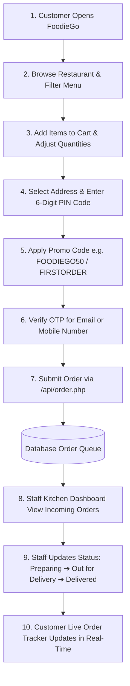

# 🍕 FoodieGo — Full-Stack Interactive Food Delivery Platform

FoodieGo is a modern, feature-rich web application for online food ordering, menu exploration, live order tracking, and restaurant staff management. Built with modern UI aesthetics, dynamic cart controls, promo code discounts, multi-address management with PIN codes, OTP verification, and dual-backend support (PHP & Python).

---

## 📸 Website UI Showcase & Interface Screenshots

### 🏬 1. Customer Homepage & Food Catalog Interface


### 🛒 2. Swiggy-Style Cart, Address Manager & OTP Verification Modal


---

## 🌟 Key Features

### 🛒 **1. Customer Portal & Cart Experience**
- **Interactive Food Catalog**: Filter dishes by category (Burgers, Pizza, Biryani, Chinese, Desserts, Beverages) and search in real-time.
- **Swiggy-Style Cart**:
  - Dish thumbnail previews & quantity steppers (`+` / `-`).
  - Itemized bill breakdown (Subtotal, GST, Delivery Fee, Packaging).
  - Dynamic promo code chips (`FOODIEGO50`, `FIRSTORDER`, `TEEJ20`, `BIHAR25`) with instant discount calculations.
  - Free delivery milestone indicator.

### 📍 **2. Address Manager & PIN Code System**
- Top header location selector with direct Address Manager modal (`#addressModal`).
- Saved address presets with category pills (`🏠 Home`, `🏢 Work`, `🎓 Campus`).
- Mandatory 6-digit PIN code field (`#pincode` & `#newAddrPincode`) integrated into checkouts and profiles.

### 👤 **3. Profile & Header Avatar Navigation**
- Interactive header profile badge displaying user avatar and name. Clicking the header profile section opens the **Edit Profile Modal**.
- Edit full name, profile avatar photo, mobile phone number, default address, and password with duplicate email protection.

### 🔐 **4. OTP Verification System**
- **6-Digit OTP Engine**: OTP verification for Email addresses and Mobile phone numbers (`/api/send_otp.php`, `/api/verify_otp.php`).
- **Direct Outbox Dispatch**: OTP codes are dispatched directly to customer email/SMS outbox and logged in [`logs/otp_outbox.log`](file:///c:/Chandighar%20University/SEMESTER%203/TT/food_delivery/logs/otp_outbox.log) for maximum privacy.
- Verification badges (`✅ Email Verified via OTP`, `✅ Mobile Contact Verified via OTP`).

### 📦 **5. Live Order Tracking**
- Real-time **Live Orders Tracker Modal** for customers to view active order status (*Pending*, *Preparing*, *Out for Delivery*, *Delivered*).

### 👨‍🍳 **6. Staff & Kitchen Management Portal (`/staff/`)**
- Staff dashboard for updating live order statuses and managing restaurant menus.
- **Dish & Avatar Photo Uploads**: Image upload engine (`/api/upload.php`) supporting dish photos and staff profile avatars with live image preview.

---

## 🔄 Application Workflow & Data Architecture




### 📋 Step-by-Step How the Website Works

#### **Step 1: Browsing & Menu Exploration**
- Customers visit `http://localhost:8000/`.
- Browse food categories (*Burgers, Pizza, Biryani, Chinese, Desserts, Beverages*) or search dishes using the live filter bar.
- View food items with high-quality dish photos, prices, descriptions, and dietary tags.

#### **Step 2: Cart Customization & Discount Application**
- Click `+ Add` to add dishes to the cart.
- Use quantity steppers (`+` / `-`) to adjust portions or remove items.
- Dynamic cart calculates subtotal, GST tax, packaging fee, and delivery charge in real-time.
- Apply discount promo codes (`FOODIEGO50`, `FIRSTORDER`, `TEEJ20`, `BIHAR25`) for instant savings.

#### **Step 3: Address Selection & 6-Digit PIN Code Entry**
- Select or add a delivery location via the top location bar or checkout panel.
- Choose preset categories (`🏠 Home`, `🏢 Work`, `🎓 Campus`) and enter the mandatory 6-digit PIN code.

#### **Step 4: OTP Account / Profile Verification**
- Click **Verify Email** or **Verify Mobile** in the Sign Up or Edit Profile modals.
- The system generates a secure 6-digit OTP via `/api/send_otp.php` and dispatches it directly to the customer outbox/email.
- Enter the 6-digit OTP code to unlock the green `✅ Verified` badge on your account.

#### **Step 5: Order Submission & Payment Confirmation**
- Click **Place Order**. The order payload (items, address, PIN code, applied promo, total bill) is submitted to `/api/order.php`.
- The order is recorded into the database, and the cart is reset.

#### **Step 6: Restaurant Staff Kitchen Workflow (`/staff/`)**
- Kitchen staff log into `http://localhost:8000/staff/`.
- Staff view active orders on the kitchen dashboard.
- Staff can upload dish photos and update order states (*Pending* $\rightarrow$ *Preparing* $\rightarrow$ *Out for Delivery* $\rightarrow$ *Delivered*).

#### **Step 7: Customer Live Order Tracking**
- Customers click **📦 Track Order** in the header to open the **Live Orders Tracker Modal**.
- Order progress badges update dynamically as kitchen staff process and deliver the food!

---

## 🛠️ Tech Stack

- **Frontend**: HTML5, Modern Vanilla CSS3 (Custom Design System, Glassmorphism, CSS Variables, Responsive Grid), ES6 JavaScript.
- **Backend Architecture (Dual Compatibility)**:
  - **PHP Backend**: PHP 8+ with MySQLi prepared statements.
  - **Python Server**: Built-in HTTP server ([`server.py`](file:///c:/Chandighar%20University/SEMESTER%203/TT/food_delivery/server.py)) with routing and JSON endpoints for zero-dependency local development.
- **Database**: MySQL 8+ / SQLite relational database schema ([`database.sql`](file:///c:/Chandighar%20University/SEMESTER%203/TT/food_delivery/database.sql)).

---

## 📁 Directory & File Structure

```
food_delivery/
├── admin/                  # Admin dashboard & management interfaces
│   └── index.php           # Admin control panel
├── api/                    # Backend REST API endpoints
│   ├── config.php          # Database connection configuration
│   ├── login.php           # User authentication API
│   ├── signup.php          # User registration API
│   ├── send_otp.php        # OTP generation & outbox dispatch API
│   ├── verify_otp.php      # OTP verification API
│   ├── update_profile.php  # Profile management API
│   ├── update_status.php   # Order status update API
│   ├── upload.php          # Image upload processing API
│   ├── order.php           # Order creation & retrieval API
│   └── menu_manage.php     # Menu item creation/deletion API
├── assets/                 # Frontend stylesheets & JavaScript
│   ├── style.css           # Primary UI design tokens & layout rules
│   └── app.js              # Application state, cart logic & modal handlers
├── logs/                   # Outbox logs & backend telemetry
│   └── otp_outbox.log      # Dispatched OTP logs
├── uploads/                # Uploaded dish photos & user profile avatars
├── database.sql            # Database schema & initial seed data
├── index.php               # Main customer application interface
├── server.py               # Python standalone server runner
└── README.md               # Project documentation
```

---

## 🚀 Quick Start & Installation

### Option A: Running with Python Server (Recommended for Quick Demo)

1. Open terminal inside the project directory:
   ```bash
   cd "food_delivery"
   ```
2. Start the built-in Python server:
   ```bash
   python server.py
   ```
3. Open your browser and navigate to:
   - **Customer Web App**: `http://localhost:8000/`
   - **Staff & Kitchen Portal**: `http://localhost:8000/staff/`

---

### Option B: Running with XAMPP / Apache + MySQL

1. Copy the `food_delivery` directory into your web server root (e.g. `C:\xampp\htdocs\food_delivery`).
2. Start **Apache** and **MySQL** modules from the XAMPP Control Panel.
3. Open **phpMyAdmin** (`http://localhost/phpmyadmin/`) and create a database named `food_delivery`.
4. Import [`database.sql`](file:///c:/Chandighar%20University/SEMESTER%203/TT/food_delivery/database.sql) into the database.
5. Update database credentials in [`api/config.php`](file:///c:/Chandighar%20University/SEMESTER%203/TT/food_delivery/api/config.php) if necessary.
6. Open your browser and navigate to:
   - **Customer Portal**: `http://localhost/food_delivery/`
   - **Staff Dashboard**: `http://localhost/food_delivery/staff/`

---

## 📡 API Reference Summary

| Endpoint | Method | Description |
| :--- | :--- | :--- |
| `/api/signup.php` | `POST` | Register a new customer account |
| `/api/login.php` | `POST` | Authenticate customer or staff credentials |
| `/api/send_otp.php` | `POST` | Generate and dispatch 6-digit OTP to email or phone |
| `/api/verify_otp.php` | `POST` | Verify submitted 6-digit OTP code |
| `/api/update_profile.php` | `POST` | Update user profile details (name, email, phone, address, password) |
| `/api/upload.php` | `POST` | Upload dish images or profile avatar photos |
| `/api/order.php` | `POST` | Submit food order and items |
| `/api/update_status.php` | `POST` | Update order delivery status |
| `/api/menu_manage.php` | `POST` | Add or delete menu items |

---

## 📄 License & Notes

Developed for academic and commercial food delivery platform demonstration.  
All image uploads are stored locally inside the [`uploads/`](file:///c:/Chandighar%20University/SEMESTER%203/TT/food_delivery/uploads) directory.
